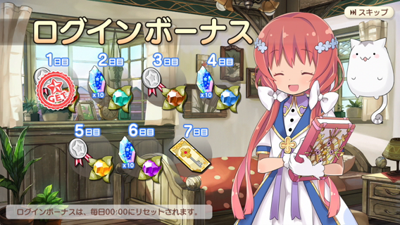
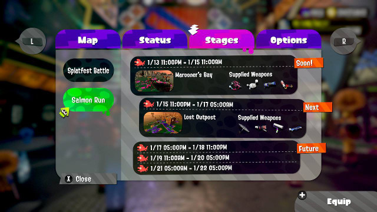

## 時區

* 在互聯網時代，產品使用者可能來自世界各地，身處不同時區。
* 即使你的目標客戶只屬於一個地區，但這些客戶可能會因為旅行公幹，而走到另一個時區。
* 個別地區可能會因為政治等因素，而改變時區。
* 若時區處理不當，可帶來漏洞和安全性問題。

### 實例

#### Aniplex《きららファンタジア》

投資近 25 億日元，日本 Aniplex 在 2017 年 12 月於 iOS 及 Android 平台推出手機遊戲[《きららファンタジア》](https://kirarafantasia.com/)。發行地區只限日本，只有日本玩家可以從日本 App Store / Google Play 下載。至於日本以外的玩家，iOS 可以用假日本賬號下載，而 Android 則要用其他不正常渠通下載。


玩家只要每天打開遊戲，就可以獲贈登入獎勵。



設計上，每位玩家在一天之內只能得到登入獎勵一次。然而，在日本 UTC+9 時區以外的玩家，例如香港和中國 UTC+8 的玩家，卻可以在一天之內得到登入獎勵兩次。經玩家測試後，懷疑是時區不同導致遊戲出錯。伺服器在日本時間 00:00 先派了一份禮物。然後在中國/香港時間 00:00，用戶端再向伺服器拿多一份禮物。（另見 [不要相信用戶端](dont_trust_client.md) ）

雖然這個漏洞在日本時區以外才發生，但也被日本玩家利用。

#### 任天堂《Splatoon 2》

日本任天堂在 2017 年 7 月，於旗下的 Switch 主機推出遊戲[《Splatoon 2》](https://splatoon.nintendo.com/)。發行地區包括美國，歐洲，日本和台灣。


遊戲中定期會舉辦一些活動，亦有活動時間表。由於遊戲的對象是全世界的玩家，所以時間表也需要處理時區。

以下是系統設定為 UTC+8 時顯示的時間表。


而當系統設定為 UTC+5 時，顯示的日期時間亦會隨之改變。



玩家無論身處甚麼時區，都可以看到符合自己時區的時間表，亦可以正常參與活動，不會遇到任何問題。

### 注意及建議

* 時區差別未必是以小時計。尼泊爾的時區是 UTC+9:45。
* 某些地區有[日光節約時間](https://zh.wikipedia.org/wiki/%E5%A4%8F%E6%97%B6%E5%88%B6) (Daylight saving time) ，在夏季時間會調快一小時。
* 儘可能使用坊間既有的程式庫做時間計算，而且要定期更新。例如，現在沒有多少人會知道 1989 年中國是行日光節約時間，而台灣也有民眾聯署要求由 UTC+8 改變為 UTC+9 。現有的時間程式庫都會處理這些改變。
* 如果服務對象不是單一時區，就要考慮為文字做時區轉換。如果無法做時區轉換，就要在提及時間的地方註明時區。

### 編程技巧

處理時間計算有兩種方法，各有優點缺點。

#### 使用同時包含時間時區的資料類別

以 Java 8 為例。 Java 8 推出 ZonedDateTime，同時包含時間和時區。

```
ZoneId chinaZone = ZoneId.of("Asia/Shanghai");

// China is UTC+8 normally
ZonedDateTime t8914china = ZonedDateTime.of(1989,1,4,0,0,0,0,chinaZone);
System.out.println("t8914china = "+t8914china.toString());
// t8914china = 1989-01-04T00:00+08:00[Asia/Shanghai]

// China have DST in 1989 June, so it is UTC+9 instead of UTC+8
ZonedDateTime t8964china = ZonedDateTime.of(1989,6,4,0,0,0,0,chinaZone);
System.out.println("t8964china = "+t8964china.toString());
// t8964china = 1989-06-04T00:00+09:00[Asia/Shanghai]
```

支援時區轉換和計算，必需 call function。絕對不要直接用年月日時分秒資料作計算。

```
ZoneId gmtZone = ZoneId.of("GMT");

// Convert to GMT
ZonedDateTime t8964gmt   = t8964china.withZoneSameInstant(gmtZone);
System.out.println("t8964gmt   = "+t8964gmt.toString());
// t8964gmt   = 1989-06-03T15:00Z[GMT]

// Number of hour between 8964 and 8914, odd number
long diff = t8914china.until(t8964china,ChronoUnit.HOURS);
System.out.println("t8964china - t8914china = "+diff+" hours");
// t8964china - t8914china = 3623 hours

// Compare between gmt and china time, same result
diff = t8914china.until(t8964gmt,ChronoUnit.HOURS);
System.out.println("t8964gmt   - t8914china = "+diff+" hours");
// t8964gmt   - t8914china = 3623 hours
```

Database 或 debug 的 raw data 顯示為 ```1989-06-04T00:00+09:00[Asia/Shanghai]``` ，可以直接閱讀。但如果顯示給使用者時，忘了轉換時區，就會有顯示問題。
     
#### Epoch time
     
Epoch time，又稱 Unix time，定義是與 1970-01-01 UTC+0 之間的秒數。

例如中國的 1989 年 6 月 4 日 00:00，轉換到 epoch time 就是 ```612889200```。

```
// Convert ZonedDateTime to epoch second
long t8964Sec = t8964china.toInstant().getEpochSecond();
System.out.println("t8964Sec   = "+t8964Sec);
// t8964Sec   = 612889200
```

當 ```612889200``` 轉換到格林威治標準時間，就會變成 1989 年 6 月 3 日 15:00。

```
// Convert epoch second to GMT
t8964gmt = ZonedDateTime.ofInstant(612889200, gmtZone);
System.out.println("t8964gmt   = "+t8964gmt.toString());
// t8964gmt   = 1989-06-03T15:00Z[GMT]
```

計算過程非常直觀，只需要簡單的加減數，亦無需轉換時區。

```
// Number of hour between 8964 and 8914
long t8914Sec = t8914china.toInstant().getEpochSecond();
diff = t8964Sec - t8914Sec;
diff /= 60*60; // number of sec in hour
System.out.println("t8964china - t8914china = "+diff+" hours");
// t8964china - t8914china = 3623 hours
```

必須使用 64 bit 數值，否則會有 [2038 年問題](https://zh.wikipedia.org/wiki/2038%E5%B9%B4%E9%97%AE%E9%A2%98)。

Database 或 debug 的 raw data 顯示為 ```612889200``` ，閱讀非常困難。由於不能直接顯示給使用者，必需做轉換，卻可以避免錯誤顯示時區的問題。

### 各語言的編碼例子

* [Java 8](https://raw.githubusercontent.com/luzi82/devcommonsense/master/example/timezone/java/Example.java)

### Extra

* [裝置時鐘的不同步](clock_unsync.md)
* [當資料與時間掛勾](time_related_data.md)
* [YouTube: The Problem with Time & Timezones - Computerphile](https://www.youtube.com/watch?v=-5wpm-gesOY)
